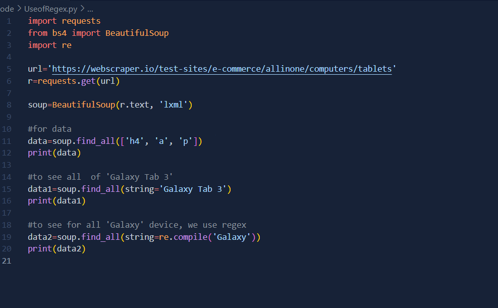
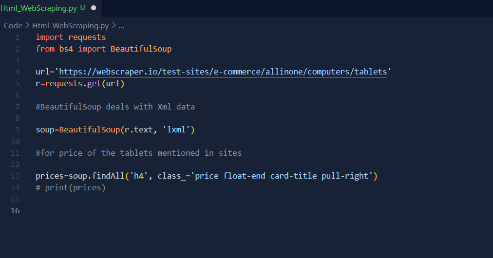

# Day 1
Web Scraping is an automatic method to obtain large amount of data from websites. Most of this data is unstructured data in html format which is then converted into structured data in a spreadsheet or a database so that it can be used in various other applications.

##### Tools used?
- Python Programming language
- Beautiful Soup
- Selenium
- Legal website for scrapping
- Any Database for data storage or MS Excel

# Day 2
Today, I understand the use of **Request** and **BeautifulSoup** library for webscraping.

- **Request Library:**
   It is used to get request access of the site through URL. This is the main and foremost step of webscraping. There are various https request code which will be shown according to the nature of the site. **For Example:** if the request message is **200** then we can access the site but if the message is **400** then we aren't allowed to access it.
   

- **Beautiful Soup:**
   Beautiful Soup is a Python library for pulling data out of HTML and XML files. It works with your favorite parser to provide idiomatic ways of navigating, searching, and modifying the parse tree. It commonly saves programmers hours or days of work.
   

# Day 3
Use of Regex is very useful in webscraping. **RegEx** stands for **Regular Expression** which helps to collect data more efficiently and help use to get the required data.
